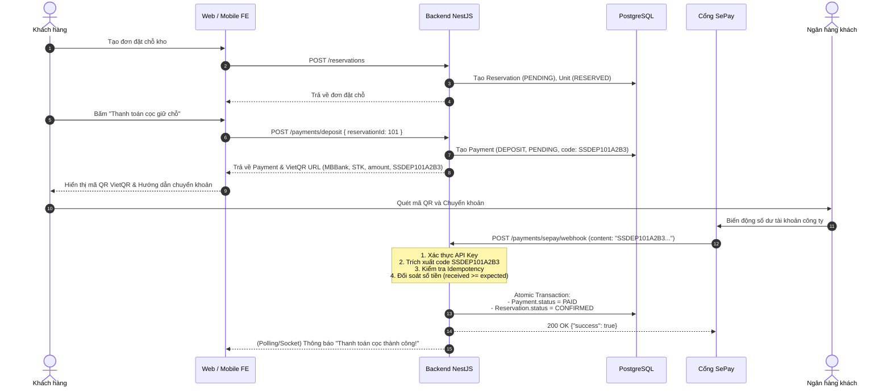

# Tích Hợp Thanh Toán (Payment) & Cổng Thanh Toán SePay (Flow 1 & Flow 2)

Tài liệu này hướng dẫn chi tiết về luồng thanh toán tự động qua SePay (VietQR / Chuyển khoản ngân hàng) cho **Flow 1 (Đặt chỗ & Tiền cọc)** và **Flow 2 (Check-in & Tiền thuê còn lại)**.

---

## 1. Tổng Quan Kiến Trúc (Architecture Overview)

Hệ thống tích hợp SePay để tự động nhận diện giao dịch chuyển khoản ngân hàng thông qua Webhook, giúp cập nhật trạng thái đơn đặt chỗ từ `PENDING` sang `CONFIRMED` mà không cần nhân viên đối soát thủ công.

### Bảng phân định loại thanh toán (Payment Types)
| Flow | Nghiệp vụ | Loại thanh toán (`paymentType`) | Số tiền tính toán | Trạng thái chuyển đổi |
| :--- | :--- | :--- | :--- | :--- |
| **Flow 1** | Đặt chỗ trực tuyến (Reservation Deposit) | `DEPOSIT` | Bằng tiền cọc (`depositAmount`) của loại kho | `Reservation: PENDING -> CONFIRMED`<br>`StorageUnit: RESERVED` |
| **Flow 2** | Nhận kho & Bàn giao (Check-in Rental) | `RENTAL` | Bằng tiền thuê còn lại (`item.price * rentalPeriod`) - **KHÔNG tính lại tiền cọc** | `Payment: PAID`<br>`StorageUnit: OCCUPIED`<br>`Reservation: COMPLETED` |

---

## 2. Luồng Nghiệp Vụ Chi Tiết (Detailed Business Flows)

### 2.1. Flow 1: Đặt Chỗ Kho & Thanh Toán Tiền Cọc (Reservation Deposit)



### 2.2. Flow 2: Check-in, Bàn Giao & Thu Tiền Thuê (Handover & Rental Payment)

1. Khi khách đến cơ sở kho, nhân viên hoặc khách tra cứu thông tin thanh toán:
   - `GET /payments/reservations/:reservationId/summary`
   - Hệ thống phản hồi:
     - `depositPaid: true` (Đã đóng cọc ở Flow 1)
     - `rentalAmount: 3.000.000` (Tiền thuê 3 tháng)
     - `remainingAmountToPay: 3.000.000` (Không thu lại 500k tiền cọc đã đóng)
2. Nếu khách thanh toán chuyển khoản trước khi nhận kho:
   - Gọi `POST /payments/rental` để tạo giao dịch `RENTAL` (mã `SSREN101X1Y2`).
   - SePay Webhook tự động khớp mã và cập nhật `Payment.status = PAID`.
3. Nhân viên tiến hành bàn giao kho (`POST /handovers/check-in`):
   - Kích hoạt hợp đồng `RentalContract (ACTIVE)`.
   - Cấp mã PIN khóa điện tử (`AccessCode`).
   - Chuyển ngăn kho sang `StorageUnit (OCCUPIED)` và đơn `Reservation (COMPLETED)`.

---

## 3. Cấu Trúc Mã Thanh Toán (Payment Code Format)

Mã thanh toán được sinh tự động, duy nhất và tối ưu cho ngân hàng nhận diện:

* **Tiền cọc (Deposit)**: `SSDEP<reservationId><random4>` (Ví dụ: `SSDEP101A2B3`)
* **Tiền thuê (Rental)**: `SSREN<reservationId><random4>` (Ví dụ: `SSREN101C4D5`)

Regex trích xuất trong Webhook: `/(SSDEP[A-Z0-9]+|SSREN[A-Z0-9]+)/i`

---

## 4. Đặc Tả Webhook & Cơ Chế Bảo Mật (SePay Webhook & Security)

### 4.1. Endpoint tiếp nhận
* **URL**: `POST /payments/sepay/webhook`
* **Xác thực**: Header `Authorization: Apikey <SEPAY_API_KEY>` hoặc `Authorization: Bearer <SEPAY_API_KEY>`.

### 4.2. Cấu trúc Payload từ SePay
```json
{
  "id": 123456,
  "gateway": "MBBank",
  "transactionDate": "2026-09-25 15:30:00",
  "accountNumber": "0123456789",
  "code": "SSDEP101A2B3",
  "content": "SSDEP101A2B3 chuyen tien dat coc kho",
  "transferType": "in",
  "transferAmount": 500000,
  "accumulated": 10500000,
  "referenceCode": "FT260925ABC123",
  "description": "Nguyen Van A transfer"
}
```

### 4.3. Các lớp bảo vệ & Quy tắc kiểm tra (Security & Validation Rules)
1. **Kiểm tra loại giao dịch**: Bỏ qua ngay các giao dịch tiền ra (`transferType === 'out'`).
2. **Kiểm tra tính bất biến (Idempotency)**:
   - Nếu Payment đã ở trạng thái `PAID` $\rightarrow$ Trả về ngay `{"success": true, "message": "Payment already processed"}` mà không thực hiện ghi đè hoặc cộng dồn.
   - Nếu `transactionReference` trùng với ID giao dịch SePay $\rightarrow$ Bỏ qua an toàn.
3. **Kiểm tra số tiền chuyển (Amount Verification)**:
   - Nếu `transferAmount < payment.amount`: Báo lỗi thiếu tiền (Underpayment), **tuyệt đối không kích hoạt xác nhận đơn đặt chỗ**.
4. **Tính nguyên tử (ACID Transaction)**:
   - Cập nhật `Payment = PAID` và `Reservation = CONFIRMED` trong cùng một `prisma.$transaction`.

---

## 5. Danh Sách API Thanh Toán

### 5.1. Tạo thanh toán tiền cọc (Flow 1)
- **Method**: `POST`
- **Endpoint**: `/payments/deposit`
- **Auth**: `JwtAuthGuard` (Customer / Staff / Admin)
- **Request Body**:
```json
{
  "reservationId": 101,
  "paymentMethod": "BANK_TRANSFER"
}
```
- **Response Success (`201 Created`)**:
```json
{
  "payment": {
    "id": 1,
    "paymentCode": "SSDEP101A2B3",
    "reservationId": 101,
    "paymentType": "DEPOSIT",
    "amount": "500000.00",
    "status": "PENDING"
  },
  "qr": {
    "qrCodeUrl": "https://img.vietqr.io/image/MBBank-0900000000-compact2.png?amount=500000&addInfo=SSDEP101A2B3...",
    "bankCode": "MBBank",
    "accountNumber": "0900000000",
    "accountName": "SELF STORAGE SYSTEM",
    "amount": 500000,
    "transferContent": "SSDEP101A2B3"
  },
  "reservation": {
    "id": 101,
    "reservationCode": "RSV-20260925-XYZ123",
    "status": "PENDING"
  }
}
```

### 5.2. Tra cứu tổng hợp thanh toán của đơn đặt chỗ (Flow 2)
- **Method**: `GET`
- **Endpoint**: `/payments/reservations/:reservationId/summary`
- **Auth**: `JwtAuthGuard`
- **Response Success (`200 OK`)**:
```json
{
  "reservationId": 101,
  "reservationCode": "RSV-20260925-XYZ123",
  "reservationStatus": "CONFIRMED",
  "depositAmount": "500000.00",
  "depositPaid": true,
  "rentalAmount": "3000000.00",
  "rentalPaid": false,
  "grandTotal": "3500000.00",
  "remainingAmountToPay": "3000000.00",
  "isReadyForCheckIn": true
}
```

### 5.3. Tạo thanh toán tiền thuê (Flow 2)
- **Method**: `POST`
- **Endpoint**: `/payments/rental`
- **Auth**: `JwtAuthGuard`
- **Request Body**:
```json
{
  "reservationId": 101,
  "paymentMethod": "BANK_TRANSFER"
}
```

### 5.4. Tiếp nhận SePay Webhook
- **Method**: `POST`
- **Endpoint**: `/payments/sepay/webhook`
- **Auth**: Public (Xác thực qua header `Authorization: Apikey <SEPAY_API_KEY>`)

---

## 6. Cấu Hình Môi Trường (.env)

Thêm các biến môi trường sau vào tệp `.env`:

```env
# SePay Gateway Configuration
SEPAY_API_KEY=your_sepay_api_key_from_dashboard
SEPAY_ACCOUNT_NUMBER=0900000000
SEPAY_BANK_CODE=MBBank
SEPAY_ACCOUNT_NAME=CONG TY CO PHAN SELF STORAGE
```

---

## 7. Hướng Dẫn Test Cục Bộ (Local Testing)

1. **Khởi chạy Backend**:
   ```bash
   npm run start:dev
   ```
2. **Tạo đơn đặt chỗ và lấy mã thanh toán cọc**:
   - Đăng nhập lấy access token.
   - Gửi `POST /payments/deposit` với `reservationId: 1`. Nhận về `paymentCode` (ví dụ: `SSDEP1A2B3`).
3. **Mô phỏng Webhook từ SePay**:
   - Gửi `POST /payments/sepay/webhook` với header `Authorization: Apikey your_sepay_api_key` và body:
   ```json
   {
     "id": 998811,
     "gateway": "MBBank",
     "transactionDate": "2026-09-25 15:30:00",
     "accountNumber": "0900000000",
     "code": "SSDEP1A2B3",
     "content": "SSDEP1A2B3 thanh toan coc kho",
     "transferType": "in",
     "transferAmount": 500000
   }
   ```
4. **Kiểm tra kết quả**:
   - Đơn đặt chỗ tự động chuyển sang `CONFIRMED`.
   - Giao dịch Payment chuyển sang `PAID`.
   - Gửi lại Webhook lần 2 để kiểm tra tính Idempotent (không bị cộng dồn hay sinh lỗi).
